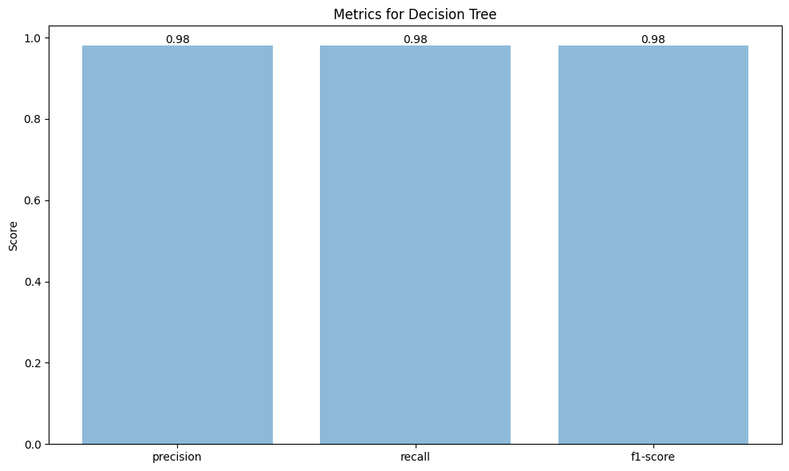
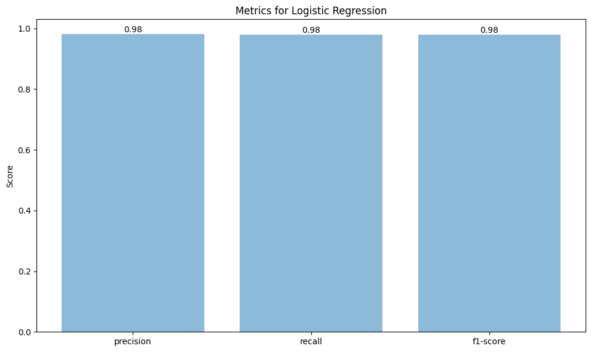

# Iris Species Classification Model Comparison

1. [Iris Species Classification Model Comparison](#iris-species-classification-model-comparison)
2. [Objective](#objective)
3. [Methodology](#methodology)
4. [Results](#results)
    - [Decision Tree Metrics](#decision-tree-metrics)
    - [Logistic Regression Metrics](#logistic-regression-metrics)
    - [Random Forest Metrics](#random-forest-metrics)
5. [Findings](#findings)

This notebook presents a comparison of different machine learning models for the classification of Iris species. The models evaluated include:

- Decision Tree
- Logistic Regression
- Random Forest
- Support Vector Machine

## Objective

The objective of this analysis is to identify the most effective model for classifying Iris species based on the dataset provided. The effectiveness of each model is evaluated based on three key metrics:

- Precision
- Recall
- F1-Score

## Methodology

Each model is trained on a given dataset and then used to make predictions on a test set. The performance of each model is evaluated using the precision, recall, and F1-score metrics. 

## Results

The results of the model comparison are visualized using bar plots, with each plot representing the performance of a single model across the three evaluation metrics.

### Decision Tree Metrics

### Logistic Regression Metrics

### Random Forest Metrics

### Support Vector Machine Metrics

## Findings

- **Precision:** There were basically 100% accuracy, which is very suspious... and looking at the size of test data, it made sence.. its too small. Then, I decided to download another dataset and foudn out the same thing.. it could be the data so i downloaded another and the data was too bad
- **Recall:** There were basically 100% Recall... the reason was the same 
- **F1-Score:** There were basically 100% Recall... the reason was the same 
